# Informe Pentesting (Talent ScoutTech)

**Fecha:** 15/01/2026 

**Autor:** Asier Gonzalez

**Entorno:** Local (Apache + PHP + SQLite3)

**Enlace a archivos en repositorio:** https://github.com/asier-toraya/HE-P3-AG.git

## Índice
0. [Introducción](#introduccion)
1. [Alcance y metodología](#alcance-y-metodologia)
2. [Hallazgos y explotación](#hallazgos-y-explotacion)
   - [Parte 1 - SQLi](#parte-1---sqli)
     - [1.a) Error en consulta SQL del formulario de login](#1a-error-en-consulta-sql-del-formulario-de-login)
     - [1.b) Ataque con diccionario para impersonar usuario](#1b-ataque-con-diccionario-para-impersonar-usuario)
     - [1.c) Error en areUserAndPasswordValid y corrección aplicada](#1c-error-en-areuserandpasswordvalid-y-correccion-aplicada)
     - [1.d) Vulnerabilidad en add_comment.php~](#1d-vulnerabilidad-en-add_commentphp)
   - [Parte 2 - XSS](#parte-2---xss)
     - [2.a) Comentario con alert en show_comments.php](#2a-comentario-con-alert-en-show_commentsphp)
     - [2.b) Uso de &amp; en links con parámetros GET](#2b-uso-de-amp-en-links-con-parametros-get)
     - [2.c) Problema en show_comments.php y corrección](#2c-problema-en-show_commentsphp-y-correccion)
     - [2.d) Otras páginas afectadas](#2d-otras-paginas-afectadas)
   - [Parte 3 - Control de acceso, autenticación y sesiones de usuarios](#parte-3---control-de-acceso-autenticación-y-sesiones-de-usuarios)
     - [a) Medidas de seguridad para evitar un registro inseguro](#a-medidas-de-seguridad-para-evitar-un-registro-inseguro)
     - [b) Medidas de seguridad para asegurar el login](#b-medidas-de-seguridad-para-asegurar-el-login)
     - [c) Restricciones para el acceso a register.php](#c-restricciones-para-el-acceso-a-registerphp)
     - [d) Configuración de la carpeta private para evitar acceso no autorizado](#d-configuración-de-la-carpeta-private-para-evitar-acceso-no-autorizado)
     - [e) Análisis y aseguramiento del flujo de sesiones de usuarios](#e-análisis-y-aseguramiento-del-flujo-de-sesiones-de-usuarios)
   - [Parte 4 - Servidores web](#parte-4---servidores-web)
     - [a) Medidas de seguridad para reducir riesgos en el servidor web](#a-medidas-de-seguridad-para-reducir-riesgos-en-el-servidor-web)
   - [Parte 5 - CSRF](#parte-5---csrf)
     - [a) Botón Profile con formulario malicioso en list_players.php](#a-botón-profile-con-formulario-malicioso-en-list_playersphp)
     - [b) Creación de un comentario para un ataque CSRF sin interacción del usuario](#b-creación-de-un-comentario-para-un-ataque-csrf-sin-interacción-del-usuario)
     - [c) Condiciones necesarias para que el ataque funcione](#c-condiciones-necesarias-para-que-el-ataque-funcione)
     - [d) Blindaje contra CSRF usando POST y ataque alternativo](#d-blindaje-contra-csrf-usando-post-y-ataque-alternativo)
3. [CVE/CWE](#cvecwe)
4. [Conclusiones](#conclusiones)

<br>

# Introduccion
Este informe documenta la auditoria de seguridad (pentesting) de la aplicacion web **Talent ScoutTech**, cuyo objetivo es registrar jugadores y gestionar comentarios de scouting. Siguiendo el enunciado, se han identificado vulnerabilidades y se han propuesto mitigaciones basadas en buenas practicas y en las guias de OWASP.

**Objetivo y entorno**
Se documenta la resolucion tecnica de los apartados del enunciado para la aplicacion Talent ScoutTech y se responden a las preguntas planteadas. El entorno de prueba es local, con Apache, PHP y SQLite3.

<br>

---
<br>

# Alcance y metodologia
**Alcance**
- Funcionalidades auditadas: login, registro, listado/edicion de jugadores, comentarios y acceso a carpetas internas.
- Pruebas centradas en SQLi, XSS, CSRF y control de acceso/sesiones.

**Metodologia**
- OWASP Testing Guide y validaciones manuales.
- Pruebas de inyeccion y revision de codigo en `private/auth.php`, `show_comments.php` y `add_comment.php~`.
- Verificacion de impacto con evidencias visuales.

**Resumen ejecutivo**
| Hallazgo                               | Impacto                     | Severidad | Mitigacion recomendada                       |
| -------------------------------------- | --------------------------- | --------- | -------------------------------------------- |
| SQLi en login                          | Bypass de autenticacion     | Critica   | Consultas preparadas + validacion de entrada |
| SQLi en comentarios (add_comment.php~) | Suplantacion de usuario     | Alta      | Validar `id` + consultas preparadas          |
| XSS almacenado y reflejado             | Ejecucion de JS en clientes | Media     | `htmlspecialchars` en salida                 |
| CSRF en donaciones                     | Acciones sin consentimiento | Media     | Tokens CSRF + SameSite                       |
| Sesiones inseguras                     | Robo/suplantacion de sesion | Media     | Sesiones server-side + cookies seguras       |
| Acceso a `private/`                    | Exposicion de info sensible | Media     | Bloqueo en servidor/`.htaccess`              |

---
<br>

# **Hallazgos y explotacion**
## Parte 1 - SQLi

### 1.a) Error en consulta SQL del formulario de login
**Descripcion**
El formulario de login permite romper la consulta SQL cuando el campo User contiene un payload con comillas. El error muestra la consulta generada, confirmando que solo se usa `username` en el SQL.

**Pasos seguidos**
1. Abrimos `list_players.php` para forzar la pagina de login.
2. En el campo User introdujimos `"` y en Password un valor cualquiera.
3. Pulsamos Login.
4. Se mostro el error SQL con la consulta generada y el valor introducido.

**Consulta observada**
```
SELECT userId, password FROM users WHERE username = "<user>"
```

| Campo                                                          | Valor                                                    |
| -------------------------------------------------------------- | -------------------------------------------------------- |
| Escribo los valores ...                                        | User: `"`                                                |
| En el campo ...                                                | User                                                     |
| Del formulario de la página ...                                | login (`list_players.php`)                               |
| La consulta SQL que se ejecuta es ...                          | `SELECT userId, password FROM users WHERE username = ""` |
| Campos del formulario web utilizados en la consulta SQL ...    | username (User)                                          |
| Campos del formulario web no utilizados en la consulta SQL ... | password                                                 |

<br>


**Justificacion tecnica**
- `username` se usa en la consulta.
- `password` no se usa en la consulta, se compara despues en PHP.

**Evidencias**

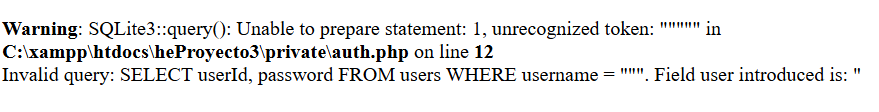
<br>
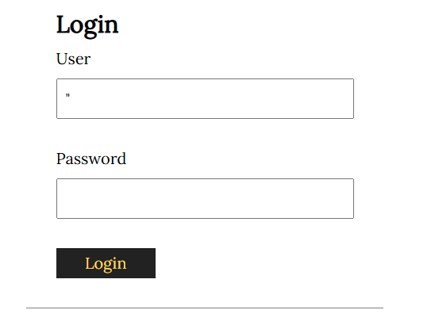

### 1.b) Ataque con diccionario para impersonar usuario
**Descripcion y pasos**
Se utilizo SQLi en el campo User con un diccionario de passwords. La autenticacion fue exitosa con la password `1234`. Para identificar el usuario autenticado se publico un comentario y se verifico el nombre asociado.

**Pasos seguidos**
1. En el login introdujimos el payload `" OR password="1234" --` en User y `1234` en Password.
2. Pulsamos Login y se accedio al listado de jugadores.
3. Entramos a un jugador, añadimos un comentario y revisamos `show_comments.php` para identificar el usuario.

**Resultado**
- Password valida encontrada: `1234`.
- Acceso a la aplicación sin conocer el usuario real.

| Campo                                                                       | Valor                                                                                                                                                                               |
| --------------------------------------------------------------------------- | ----------------------------------------------------------------------------------------------------------------------------------------------------------------------------------- |
| Explicación del ataque                                                      | SQLi en el campo User con un diccionario de contraseñas para eludir la autenticación e impersonar un usuario; se confirmó publicando un comentario y revisando el usuario asociado. |
| El ataque consiste en repetir ...                                           | el intento de login con el payload SQLi en User                                                                                                                                     |
| ... utilizando en cada interacción una contraseña diferente del diccionario | probando en cada interacción una contraseña distinta del diccionario hasta acertar.                                                                                                 |
| Campo de usuario con que el ataque ha tenido éxito                          | `" OR password="1234" --`                                                                                                                                                           |
| Campo de contraseña con que el ataque ha tenido éxito                       | `1234`                                                                                                                                                                              |

<br>

**Evidencias**

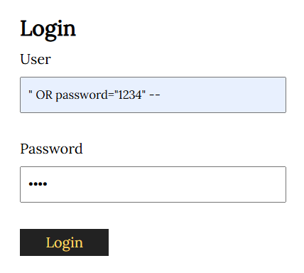
<br>
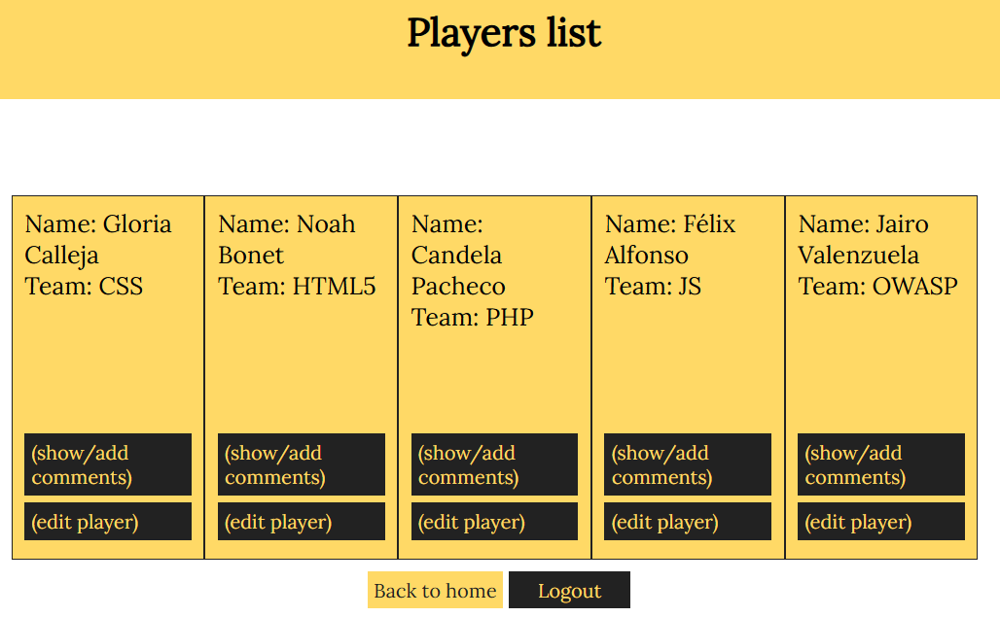
<br>
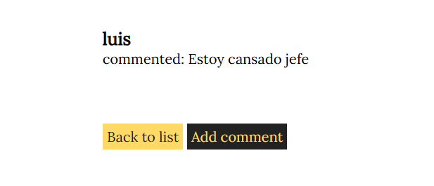
<br>

### 1.c) Error en areUserAndPasswordValid y correccion aplicada
**Descripcion**
El uso de `SQLite3::escapeString()` se hacia sobre toda la consulta, permitiendo inyeccion. La correccion es "escapar" el dato o aplicar consultas preparadas.

**Pasos seguidos**
1. Abrimos `private/auth.php`.
2. Localizamos la consulta que concatena directamente el valor de `user`.
3. Verificamos que `escapeString()` se aplicaba a toda la consulta y no al dato.
4. Propusimos y aplicamos consultas preparadas con bind.

**Correccion aplicada**
```
$stmt = $db->prepare("SELECT userId, username, password FROM users WHERE username = :username");
$stmt->bindValue(":username", $username, SQLITE3_TEXT);
$result = $stmt->execute();
```

| Campo                                        | Valor                                                                                                                                                                                            |
| -------------------------------------------- | ------------------------------------------------------------------------------------------------------------------------------------------------------------------------------------------------ |
| Explicación del error ...                    | Se aplicaba `SQLite3::escapeString()` a toda la consulta concatenada con el usuario, permitiendo romper la consulta y ejecutar SQLi.                                                             |
| Solución: Cambiar la línea con el código ... | la consulta que concatena directamente el valor de `user` con `escapeString()`.                                                                                                                  |
| ... por la siguiente línea ...               | `$stmt = $db->prepare("SELECT userId, username, password FROM users WHERE username = :username");`<br>`$stmt->bindValue(":username", $username, SQLITE3_TEXT);`<br>`$result = $stmt->execute();` |

<br>


**Justificacion**
Las consultas preparadas eliminan la concatenacion de entrada no confiable y bloquean SQLi.

**Evidencias**

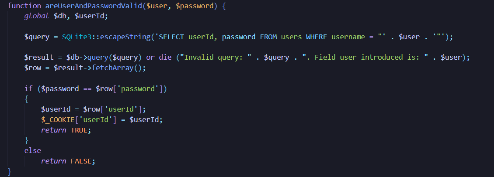

### 1.d) Vulnerabilidad en add_comment.php~php

**Descripcion**  
Al revisar el archivo copia de `add_comment.php~php` revela una consulta vulnerable que usa `$_GET['id']` sin validar. Se puede forzar el `userId` y publicar comentarios en nombre de otros.

Consulta:
`INSERT INTO comments (playerId, userId, body) VALUES ('".$_GET['id']."', '".$_COOKIE['userId']."', '$body');`

**Proceso de explotacion (texto)**  
Se localiza el archivo `add_comment.php~php` al listar recursos del directorio web. El codigo muestra que el `INSERT` concatena directamente `$_GET['id']`. Al manipular ese parametro, se puede cerrar el valor original y aportar nuevos valores para `playerId`, `userId` y `body`. 

Payload:
`http://localhost/heProyecto3/add_comment.php?id=3','2','Fichaje interesante') -- -`

Con este payload se cierra la consulta y se fuerza el userId, lo que hace que el comentario se guarde como si lo hubiera escrito el usuario con userId=2.

**Mitigacion**
- Validar `id` como entero.
- Consultas preparadas con bind.
- Evitar publicar backups accesibles.

| Campo                                            | Valor                                                                                                                                                                                                                                                                          |
| ------------------------------------------------ | ------------------------------------------------------------------------------------------------------------------------------------------------------------------------------------------------------------------------------------------------------------------------------ |
| Vulnerabilidad detectada                         | SQL Injection (manipulación de parámetros) en `add_comment.php~php` por uso directo de `$_GET['id']` sin validación ni consultas preparadas.                                                                                                                                      |
| Descripción del ataque                           | El archivo de backup `add_comment.php~php` expone una consulta `INSERT` vulnerable que concatena directamente `$_GET['id']`. Al manipular el parámetro `id`, un atacante puede cerrar la consulta e inyectar valores propios, publicando comentarios en nombre de otros usuarios. |
| ¿Cómo podemos hacer que sea segura esta entrada? | Validar `id` como entero, usar consultas preparadas con `bind`, y evitar que archivos de backup (`~`, `.bak`) sean accesibles desde el servidor web.                                                                                                                           |

<br>

---

## Parte 2 - XSS

### 2.a) Comentario con alert en show_comments.php
**Descripcion**
Se inyecto un payload XSS en comentarios. Al visualizar la pagina `show_comments.php`, el script se ejecuto en el navegador.

**Pasos seguidos**
1. Abrimos un jugador y pulsamos "Add comment".
2. Insertamos el payload `<script>alert('XSS')</script>` y enviamos.
3. Al volver a `show_comments.php` se ejecuto el alert.

| Campo                             | Valor                                  |
| --------------------------------- | -------------------------------------- |
| Introduzco el mensaje ...         | `<script>alert('XSS')</script>`        |
| En el formulario de la página ... | formulario "Add comment" de un jugador |

<br>

**Evidencias**
<br>
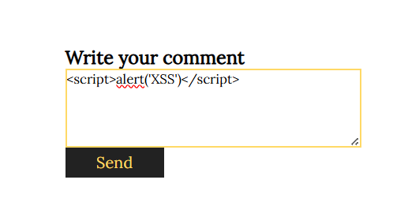
<br>
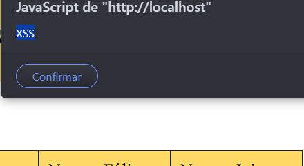

### 2.b) Uso de `&amp;` en links con parametros GET
**Respuesta**
`&amp;` es la entidad HTML para representar `&` dentro de HTML. El navegador la decodifica y la URL real usa `&`.

**Pasos seguidos**
1. Abrimos `index.php` y consultamos el codigo fuente.
2. Localizamos el enlace del footer con `&amp;`.
3. Verificamos que el navegador interpreta `&amp;` como `&`.

| Campo           | Valor                                                                                                             |
| --------------- | ----------------------------------------------------------------------------------------------------------------- |
| Explicación ... | `&amp;` es la entidad HTML para representar `&` dentro de HTML; el navegador la decodifica y la URL real usa `&`. |

<br>

**Evidencias**
<br>
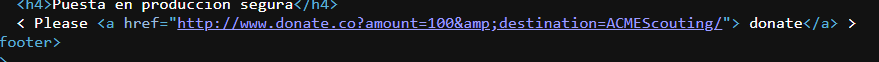

### 2.c) Problema en show_comments.php y correccion
**Descripcion**
Los comentarios se imprimen sin escape, permitiendo ejecutar HTML/JS. Ademas, `$_GET['id']` se usa en la consulta sin validar.
- Salida sin escape de `username` y `body` (XSS).
- Uso directo de `$_GET['id']` en la query (SQLi).

**Pasos seguidos**
1. Abrimos `show_comments.php` en el editor.
2. Identificamos la query con `$_GET['id']` sin sanitizar.
3. Revisamos el `echo` de `username` y `body` sin escape.
4. Propusimos el uso de consultas preparadas y `htmlspecialchars`.

| Campo                                    | Valor                                                                                             |
| ---------------------------------------- | ------------------------------------------------------------------------------------------------- |
| ¿Cuál es el problema?                    | Salida sin escape de `username` y `body` (XSS) y uso directo de `$_GET['id']` en la query (SQLi). |
| Sustituyo el código de la/las líneas ... | la consulta con `$_GET['id']` y los `echo` de `username`/`body` sin sanitizar.                    |
| ... por el siguiente código ...          | ...                                                                                               |

```
if (isset($_GET['id'])) {
            $playerId = (int) $_GET['id'];

            $stmt = $db->prepare(
                'SELECT commentId, username, body
                FROM comments C, users U
                WHERE C.playerId = :playerId AND U.userId = C.userId
                ORDER BY C.playerId DESC'
            );
            $stmt->bindValue(':playerId', $playerId, SQLITE3_INTEGER);

            $result = $stmt->execute() or die('Invalid query');

            while ($row = $result->fetchArray(SQLITE3_ASSOC)) {
                $safeUser = htmlspecialchars($row['username'], ENT_QUOTES, 'UTF-8');
                $safeBody = htmlspecialchars($row['body'], ENT_QUOTES, 'UTF-8');

                echo "<div>
                <h4> {$safeUser}</h4>
                <p>commented: {$safeBody}</p>
              </div>";
            }
        }
```

<br>

**Mitigación propuesta**
- Escapar salida con `htmlspecialchars`.
- Preparar la consulta y bindear `id`.

**Evidencias**
<br>

**Error original** <br>
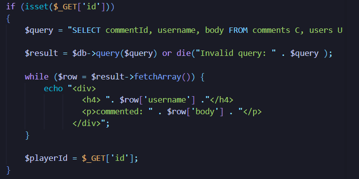

<br>

**Correccion propuesta** <br>
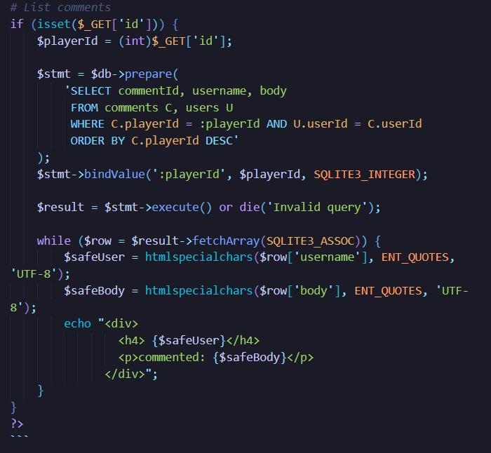

### 2.d) Otras paginas afectadas
**Descripcion**
Se confirmo XSS en `list_players.php` insertando un payload HTML desde `insert_player.php`.

**Pasos seguidos**
1. Abrimos `insert_player.php` y editamos un jugador.
2. Insertamos el payload en el campo "Player name".
3. Guardamos y volvimos a `list_players.php`.
4. Se ejecuto el alert al cargar el listado.

**Payload usado**
```
</h1><h1>
```

| Campo                       | Valor                                                                                                                                   |
| --------------------------- | --------------------------------------------------------------------------------------------------------------------------------------- |
| Otras páginas afectadas ... | `list_players.php` (payload insertado desde `insert_player.php`).                                                                       |
| ¿Cómo lo he descubierto?    | Editando un jugador en `insert_player.php`, insertando el payload en "Player name" y verificando el alert al cargar `list_players.php`. |

<br>

**Evidencias**
<br>
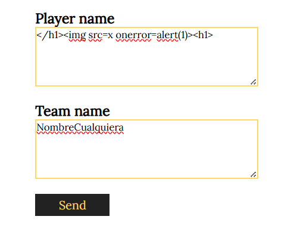
<br>
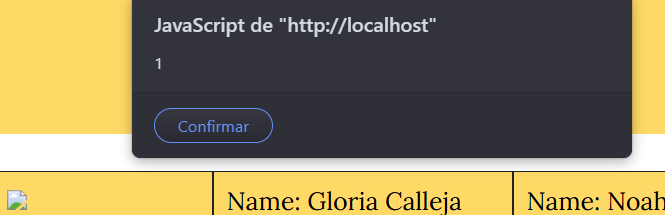

---

# Parte 3 - Control de acceso, autenticación y sesiones de usuarios

## a) Medidas de seguridad para evitar un registro inseguro
Al analizar register.php se detectan varias debilidades en el proceso de registro. La creación de usuarios se realiza con pocos controles y mediante consultas SQL inseguras, lo que puede dar lugar a SQL Injection o a registros incorrectos.

Además, los datos se usan directamente en la consulta, no se validan campos vacíos, los errores no se tratan de forma segura, las contraseñas se almacenan en texto plano y el formulario carece de protección CSRF.

**Medidas propuestas**

- Token CSRF por sesión.
- Validación server-side (longitud, alfanumérico, password mínima).
- `password_hash`.
- Inserción con consulta preparada.
- Mensajes de error escapados.
- Registro requiere autenticación.

Justificación por medida:
| Medida                                                            | Justificación                                                                  |
| ----------------------------------------------------------------- | ------------------------------------------------------------------------------ |
| Token CSRF por sesión.                                            | Evita registros forzados desde otros sitios y valida la intención del usuario. |
| Validación server-side (longitud, alfanumérico, password mínima). | Aplica controles aunque se manipule el cliente y reduce credenciales débiles.  |
| `password_hash`.                                                  | Almacena contraseñas con hash seguro y sal, evitando texto claro.              |
| Inserción con consulta preparada.                                 | Separa datos y consulta, bloqueando SQLi en el registro.                       |
| Mensajes de error escapados.                                      | Evita XSS reflejado si el error incluye entrada de usuario.                    |
| Registro requiere autenticación.                                  | Evita altas no autorizadas y reduce spam de cuentas.                           |

Cambios aplicados (codigo):
Archivo: `/register.php`
```php
require dirname(__FILE__) . '/private/auth.php';
if (session_status() !== PHP_SESSION_ACTIVE) {
    session_start();
}
if (empty($_SESSION['csrf_token'])) {
    $_SESSION['csrf_token'] = bin2hex(random_bytes(16));
}
if (!hash_equals($_SESSION['csrf_token'], $_POST['csrf_token'] ?? '')) {
    $errors[] = 'Invalid CSRF token.';
}
if ($username === '' || $password === '') {
    $errors[] = 'Username and password are required.';
}
if ($username !== '' && !preg_match('/^[A-Za-z0-9_]+$/', $username)) {
    $errors[] = 'Username must be alphanumeric.';
}
if ($password !== '' && strlen($password) < 8) {
    $errors[] = 'Password must be at least 8 characters.';
}
$passwordHash = password_hash($password, PASSWORD_DEFAULT);
$stmt = $db->prepare('INSERT INTO users (username, password) VALUES (:username, :password)');
$stmt->bindValue(':username', $username, SQLITE3_TEXT);
$stmt->bindValue(':password', $passwordHash, SQLITE3_TEXT);
```

**Evidencias**
<br>
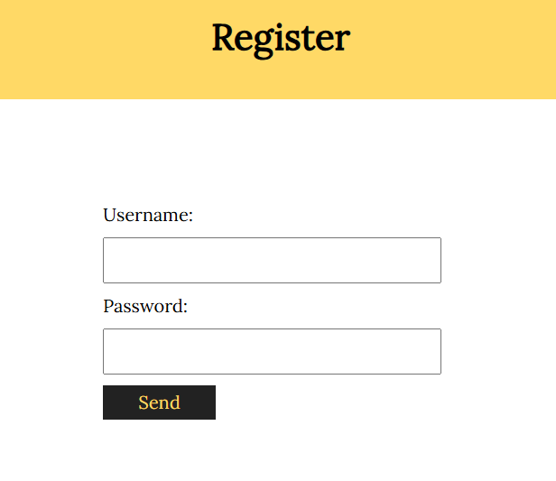
<br>
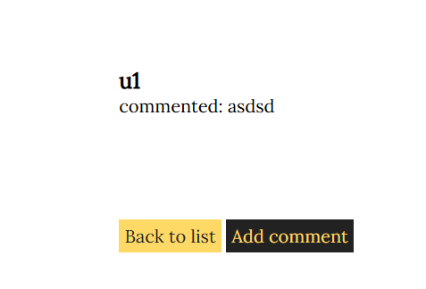
<br>

**Registro arreglado**
<br>
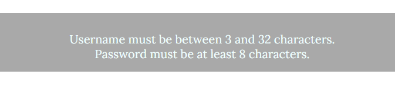

## b) Medidas de seguridad para asegurar el login
Tras revisar auth.php, se detectan varias debilidades en el sistema de autenticación. La validación de credenciales es insegura, lo que permite ataques como SQL Injection y la ejecución de código malicioso mediante mensajes de error.

Además, las consultas SQL usan directamente datos del usuario, las contraseñas se manejan en texto plano, las cookies de sesión no están protegidas y no existe protección frente a ataques CSRF en los formularios de login y logout.

**Medidas propuestas**

- Consultas preparadas (anti-SQLi).
- `password_verify` y migración automática de contraseñas en claro.
- Sesiones con `$_SESSION` y flags Secure/HttpOnly/SameSite=Lax.
- Regeneración de ID de sesión al login.
- Rate limit (5 intentos, bloqueo 5 min).
- Timeout por inactividad (15 min).

Justificación por medida:
| Medida                                                            | Justificación                                                           |
| ----------------------------------------------------------------- | ----------------------------------------------------------------------- |
| Consultas preparadas (anti-SQLi).                                 | Elimina concatenación insegura y evita inyección en login.              |
| `password_verify` y migración automática de contraseñas en claro. | Permite validar hashes y mejorar seguridad sin romper cuentas antiguas. |
| Sesiones con `$_SESSION` y flags Secure/HttpOnly/SameSite=Lax.    | Protege cookies frente a robo y reduce impacto de CSRF.                 |
| Regeneración de ID de sesión al login.                            | Mitiga fijación de sesión tras autenticación.                           |
| Rate limit (5 intentos, bloqueo 5 min).                           | Reduce ataques de fuerza bruta y abuso de credenciales.                 |
| Timeout por inactividad (15 min).                                 | Limita la ventana de secuestro de sesión.                               |

Cambios aplicados (codigo):
Archivo: `/private/auth.php`
```php
ini_set('session.use_strict_mode', '1');
session_set_cookie_params([
    'secure' => $secure,
    'httponly' => true,
    'samesite' => 'Lax',
]);
const MAX_LOGIN_ATTEMPTS = 5;
const LOCKOUT_SECONDS = 300;
const SESSION_TIMEOUT = 900;

function fetchUserByUsername($db, $username) {
    $stmt = $db->prepare('SELECT userId, username, password FROM users WHERE username = :username');
    $stmt->bindValue(':username', $username, SQLITE3_TEXT);
    $result = $stmt->execute();
    if ($result === false) {
        return null;
    }
    $row = $result->fetchArray(SQLITE3_ASSOC);
    return $row ?: null;
}

if ($row && verifyPasswordValue($password, $row['password'])) {
    session_regenerate_id(true);
    $_SESSION['userId'] = $row['userId'];
    upgradePasswordIfNeeded($db, $row['userId'], $password, $row['password']);
}
```

**Evidencias**
<br>
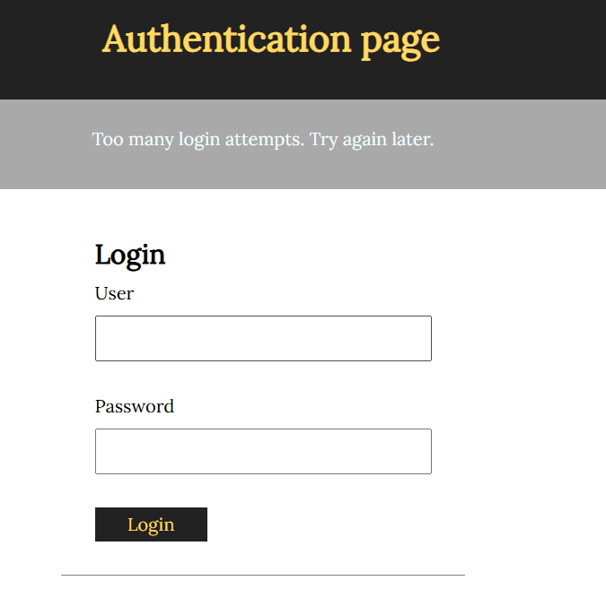
<br>
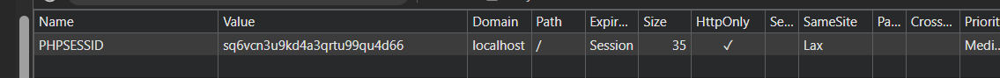

## c) Restricciones para el acceso a register.php
Al analizar register.php se comprueba que el formulario de registro es accesible para cualquier usuario, independientemente de si está autenticado o no. Esto puede suponer un problema si no se desea permitir la creación libre de cuentas.

Esta situación facilita registros no autorizados y aumenta la superficie de riesgo de la aplicación.

**Medidas propuestas**

- `register.php` exige login.
- Registro deshabilitado por defecto, con lista blanca opcional.

Justificación por medida:
| Medida                                                         | Justificación                                    |
| -------------------------------------------------------------- | ------------------------------------------------ |
| `register.php` exige login.                                    | Restringe el registro a usuarios autorizados.    |
| Registro deshabilitado por defecto, con lista blanca opcional. | Permite control granular y evita altas abiertas. |

Cambios aplicados (codigo):
Archivo: `/register.php`
```php
$registrationEnabled = false;
$allowedUsers = [];
$currentUser = $_SESSION['user'] ?? '';
$registrationLocked = !$registrationEnabled && !in_array($currentUser, $allowedUsers, true);
if ($registrationLocked) {
    http_response_code(403);
    $errors[] = 'Registration is disabled for this account.';
}
```

**Evidencias**
<br>
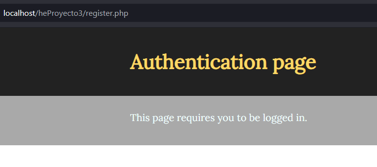
<br>
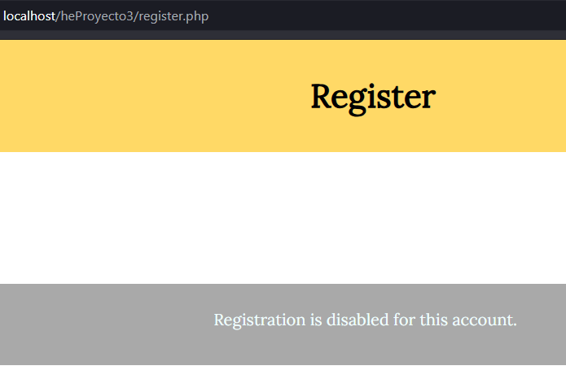

## d) Configuración de la carpeta private para evitar acceso no autorizado   
Al comenzar la práctica se da por hecho que la carpeta private no es accesible desde el navegador, pero al desplegar la aplicación en local esto no siempre se cumple. Una configuración incorrecta del servidor puede permitir el acceso directo a archivos con información sensible, como configuraciones o credenciales.

Durante el análisis se observa que la carpeta podría ser accesible públicamente, que archivos como conf.php o auth.php contienen datos críticos y que la protección depende únicamente de asumir que no se podrá acceder a ellos.   

**Medidas propuestas**

- `private/.htaccess` deniega acceso HTTP directo.
- Guard server-side en `private/conf.php` y `private/auth.php`.

Justificación por medida:
| Medida                                                        | Justificación                                                  |
| ------------------------------------------------------------- | -------------------------------------------------------------- |
| `private/.htaccess` deniega acceso HTTP directo.              | Impide exponer archivos sensibles desde el navegador.          |
| Guard server-side en `private/conf.php` y `private/auth.php`. | Defensa en profundidad si falla la configuración del servidor. |

Cambios aplicados (codigo):
Archivo: `/private/.htaccess`
```apacheconf
<IfModule mod_authz_core.c>
    Require all denied
</IfModule>
<IfModule !mod_authz_core.c>
    Order allow,deny
    Deny from all
</IfModule>
Options -Indexes
```
Archivo: `/private/conf.php` y `/private/auth.php`
```php
if (basename(__FILE__) === basename($_SERVER['SCRIPT_FILENAME'])) {
    http_response_code(403);
    exit('Forbidden');
}
```

**Evidencias**
<br>

**Problema**<br>
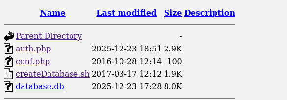
<br>

**Resuelto**<br>
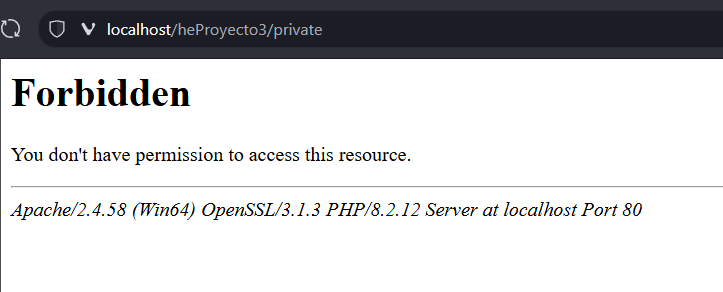

## e) Análisis y aseguramiento del flujo de sesiones de usuarios
Al revisar el manejo de sesiones de la aplicación se detecta que la autenticación no está correctamente protegida. El acceso se basa en cookies que almacenan directamente el usuario y la contraseña, lo que supone un riesgo importante.

Durante el análisis se observa que las credenciales se guardan en texto plano, no se usan sesiones de PHP, la sesión depende de cookies manipulables por el cliente, no se regeneran identificadores tras el login y no existe un control de caducidad o cierre automático de sesión.

**Medidas propuestas**

- Sesiones de servidor, sin cookies con credenciales.
- Regeneración de ID y expiración por inactividad.
- `session.use_strict_mode` activado.

Justificación por medida:
| Medida                                              | Justificación                                            |
| --------------------------------------------------- | -------------------------------------------------------- |
| Sesiones de servidor, sin cookies con credenciales. | Evita exponer credenciales en el cliente.                |
| Regeneración de ID y expiración por inactividad.    | Reduce fijación de sesión y limita sesiones abandonadas. |
| `session.use_strict_mode` activado.                 | Rechaza IDs no válidos y mitiga fijación.                |

Cambios aplicados (codigo):
Archivo: `/private/auth.php`
```php
if (isset($_SESSION['last_activity']) && (time() - $_SESSION['last_activity']) > SESSION_TIMEOUT) {
    destroySession();
}
if (isset($_POST['Logout'])) {
    destroySession();
    header("Location: index.php");
    exit;
}
```

**Evidencias**
<br>


# Parte 4 - Servidores web
## a) Medidas de seguridad para reducir riesgos en el servidor web
Inventario del servidor (componentes):
- Servidor web (Apache).
- Runtime PHP.
- Base de datos SQLite (archivo `database.db`).
- Sistema operativo y filesystem.
- Transporte HTTPS/TLS.
- Cabeceras de seguridad HTTP.
- Observabilidad (logs y rate limiting).
- Entorno de despliegue.
- Backups y recuperación.

| Componente                            | Medidas                                                                                               | Justificación                                                 |
| ------------------------------------- | ----------------------------------------------------------------------------------------------------- | ------------------------------------------------------------- |
| Servidor web (Apache)                 | Actualizar Apache; deshabilitar directory listing; limitar métodos HTTP y deshabilitar TRACE/OPTIONS. | Reduce superficie de ataque y corrige CVE conocidas.          |
| Runtime PHP                           | Actualizar PHP; endurecer `php.ini` (display_errors off, límites de subida, funciones peligrosas).    | Evita filtrado de información y reduce vectores de ejecución. |
| Base de datos SQLite                  | Actualizar SQLite; permisos mínimos sobre `database.db`.                                              | Limita accesos no autorizados y el impacto de un compromiso.  |
| Sistema operativo y filesystem        | Permisos mínimos en archivos y carpetas; proteger rutas sensibles (p. ej. `private/`).                | Restringe el acceso a datos críticos y reduce exposición.     |
| Transporte HTTPS/TLS                  | Forzar HTTPS y HSTS en producción.                                                                    | Protege confidencialidad e integridad y evita downgrades.     |
| Cabeceras de seguridad HTTP           | CSP, X-Frame-Options, X-Content-Type-Options, Referrer-Policy.                                        | Mitigan XSS, clickjacking, MIME sniffing y fuga de referrer.  |
| Observabilidad (logs y rate limiting) | Rate limiting y monitoreo de logs.                                                                    | Dificulta fuerza bruta y permite detección temprana.          |
| Entorno de despliegue                 | Separación de entornos y ocultación de versiones.                                                     | Minimiza exposición de datos y reduce fingerprinting.         |
| Backups y recuperación                | Backups regulares y pruebas de restauración.                                                          | Permiten recuperar el servicio ante incidentes o corrupción.  |


# Parte 5 - CSRF
## a) Botón Profile con formulario malicioso en list_players.php

| Campo           | Valor                                                                                               |
| --------------- | --------------------------------------------------------------------------------------------------- |
| En el campo ... | `team`                                                                                              |
| Introduzco ...  | HTML que renderiza un botón con petición GET a `web.pagos/donate.php?amount=100&receiver=attacker`. |

**Payload usado**
```html
<form action="http://web.pagos/donate.php" method="GET">
  <input type="hidden" name="amount" value="100">
  <input type="hidden" name="receiver" value="attacker">
  <button type="submit">Profile</button>
</form>
```

**Evidencias**
<br>
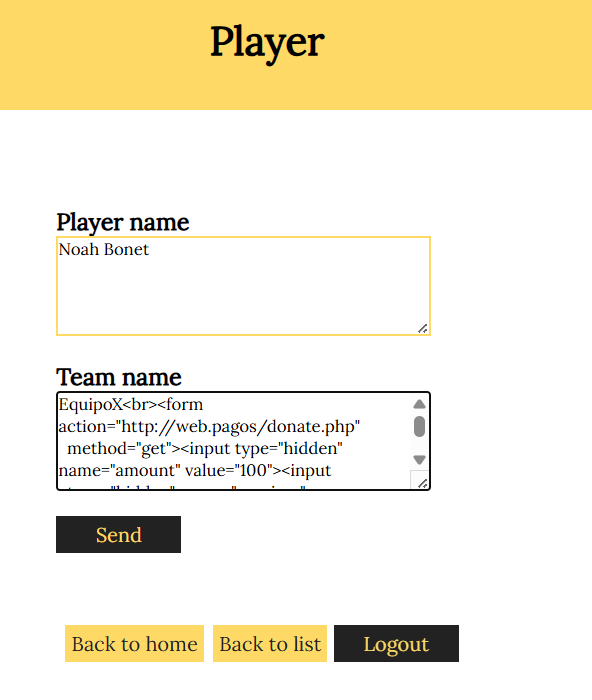
<br>


## b) Creación de un comentario para un ataque CSRF sin interacción del usuario
Se publicó un comentario con un payload que realiza la petición al cargar `show_comments.php`.

**Payload usado**
```html

```

**Evidencias**
<br>
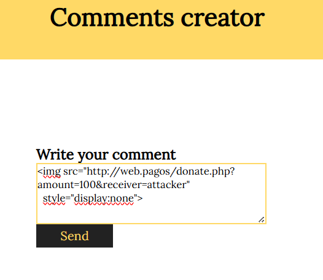
<br>
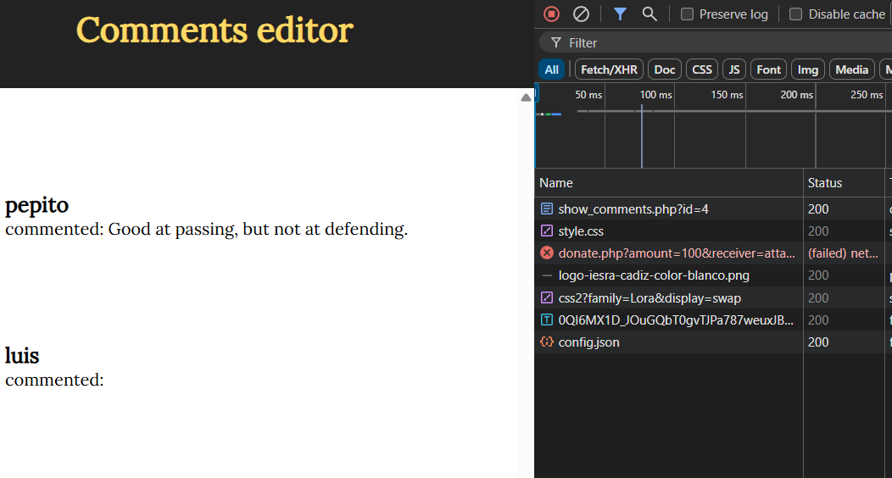

## c) Condiciones necesarias para que el ataque funcione
- La víctima debe estar autenticada en `web.pagos`.
- La plataforma debe aceptar la petición sin token CSRF.
- La cuenta debe tener fondos y permisos para donar.

## d) Blindaje contra CSRF usando POST y ataque alternativo
```html
<form id="csrf" action="http://web.pagos/donate.php" method="POST">
  <input type="hidden" name="amount" value="100">
  <input type="hidden" name="receiver" value="attacker">
</form>
<script>document.getElementById('csrf').submit();</script>
```
El uso de POST por si solo no es suficiente: el navegador sigue enviando cookies de sesion y la peticion puede forjarse sin un token CSRF o validaciones SameSite/Origin.

<br>

# CVE/CWE
No existe un CVE asignado para estos hallazgos (aplicacion local). Se incluye CVSS v3.1 estimado y la clasificacion CWE correspondiente.

| Vulnerabilidad                                    | CVE               | CWE         | CVSS v3.1 (Base) | Nota                                            |
| ------------------------------------------------- | ----------------- | ----------- | ---------------- | ----------------------------------------------- |
| SQLi en login (bypass de autenticación)           | N/A (no asignado) | CWE-89      | 9.8              | Permite acceso no autorizado.                   |
| SQLi en add_comment.php~ (suplantación de userId) | N/A (no asignado) | CWE-89      | 7.5              | Permite publicar comentarios como otro usuario. |
| SQLi en show_comments.php (playerId)              | N/A (no asignado) | CWE-89      | 6.5              | Puede exponer datos o alterar resultados.       |
| XSS almacenado (comentarios/listado)              | N/A (no asignado) | CWE-79      | 6.1              | Requiere interacción del usuario.               |
| CSRF en donaciones (GET/POST)                     | N/A (no asignado) | CWE-352     | 6.5              | Modifica estado sin consentimiento.             |
| Sesiones/cookies sin endurecer (antes de medidas) | N/A (no asignado) | CWE-384/613 | 5.3              | Riesgo de fijación o robo de sesión.            |
| Acceso directo a private/                         | N/A (no asignado) | CWE-552     | 5.3              | Exposición de archivos sensibles.               |


# Conclusiones
En este proyecto se ha auditado la aplicación Talent ScoutTech y su servidor web, detectando varias vulnerabilidades comunes en aplicaciones web y proponiendo medidas de mitigación sencillas y efectivas.

Los problemas más relevantes, como SQL Injection, XSS y CSRF, se deben principalmente a una validación insuficiente de las entradas de usuario y a una gestión insegura de sesiones y permisos del servidor.

Tras aplicar las correcciones recomendadas, la aplicación valida correctamente los datos, reduce el riesgo de ataques y protege mejor la información sensible. Además, el proyecto ha permitido comprender cómo se producen estos ataques y qué medidas prácticas pueden aplicarse para mitigarlos.